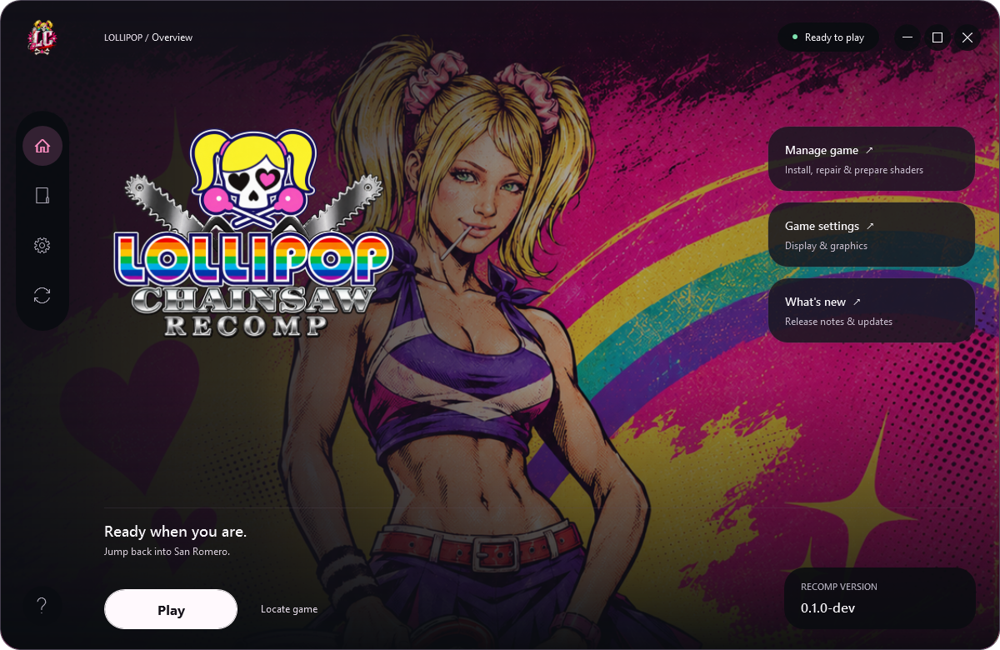

# Lollipop Chainsaw Recomp

  

The original Xbox 360 game, recompiled for Windows. Requires your own game copy;
game files are not included.

- Press **F6** to open **Cheats**. Toggle unlimited health, gold and platinum
  medals, or a full Star Soul gauge with a mouse, keyboard, or controller.
  Cheats take effect immediately and reset on restart. **All Off** disables
  every cheat. The game can still save medals and purchases.
- Change **graphics settings** in-game without restarting, including render and
  shadow resolution, frame rate, anti-aliasing, and color dithering.

## Getting started

Download the [latest launcher](https://github.com/kxrxh/lollipop-chainsaw-recomp/releases/latest)
and run it. Requires Windows x64, internet for setup, and an ISO of the
[supported Xbox 360 disc](docs/BUILDING.md#supported-game).

The launcher checks for stable releases on startup and shows an in-app notice when
a newer release is available. Select the notice for release notes, then use
**Updates → Update launcher**. Apply game updates from
**Manage game → Apply launcher build / Repair**. Saves and settings are kept.

## Launcher

Graphics settings and updates

## Help

Install your own Xbox 360 costume DLC from **Costumes & DLC** in the launcher.
Choose one or more ZIPs, or a folder containing the original packages, review the
detected packs, then select **Install**. Restart the game to use your costumes.
Existing packs and saves are kept. Older installations need
**Manage game → Apply launcher build / Repair** once to add the DLC reader.

- [Compatibility and known issues](docs/COMPATIBILITY.md) · [Default controls](docs/COMPATIBILITY.md#controls)
- [Setup errors](docs/BUILDING.md#setup-and-build-problems) · [Update or repair](docs/BUILDING.md#updating-or-removing-an-installation)
- [Stutter, crashes and input problems](docs/COMPATIBILITY.md#gameplay-problems)

To build from source or contribute a fix, see the [build guide](docs/BUILDING.md)
and [development guide](docs/DEVELOPMENT.md).

## Credits

By [kxrxh](https://github.com/kxrxh). Built with
[ReXGlue](https://github.com/rexglue/rexglue-sdk) and Xenia.
[BSD-3-Clause](LICENSE) · [Credits and artwork notices](THIRD_PARTY.md).
